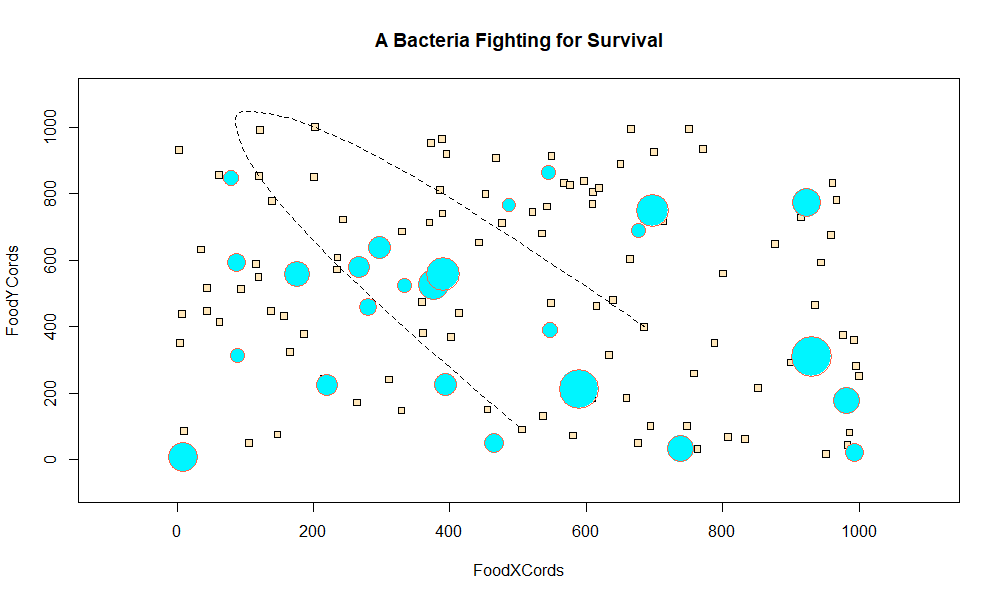

## First Challenge of DATA 100 class  
 

### This plot represents the path of a bacteria in a petri dish, aiming to eat the square food while avoiding larger (hungry) bacteria.  
#### Inspired by incredible game: [agar.io](https://agar.io/)

