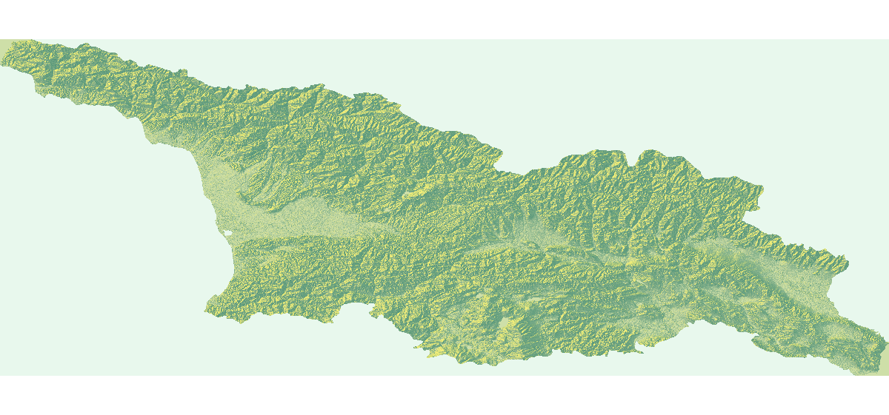
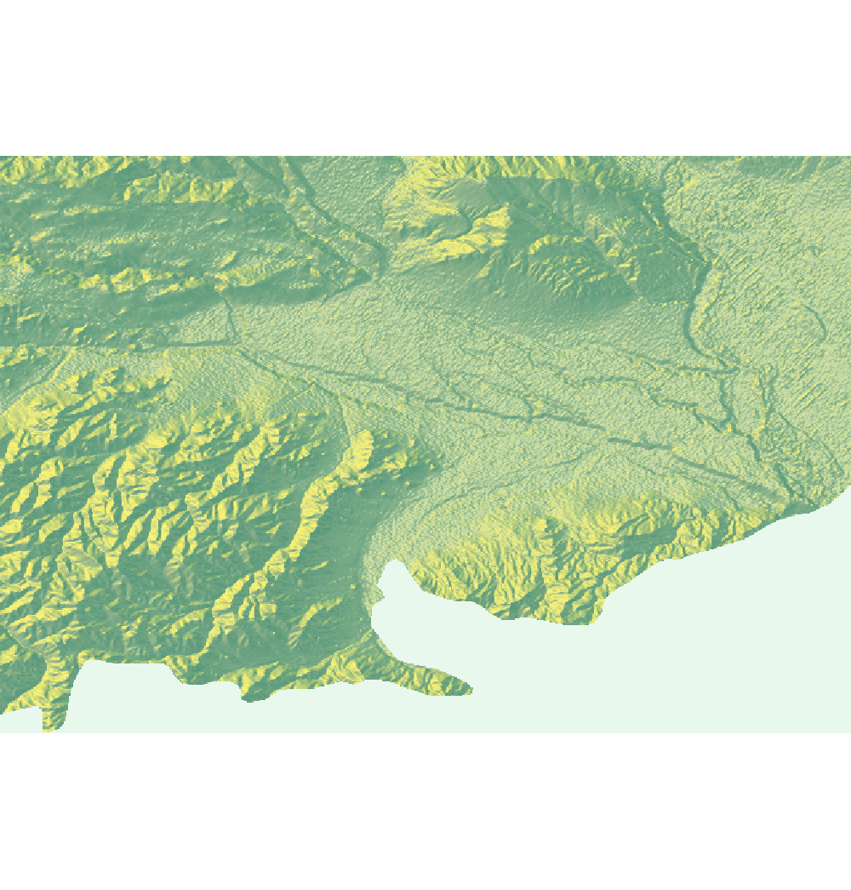
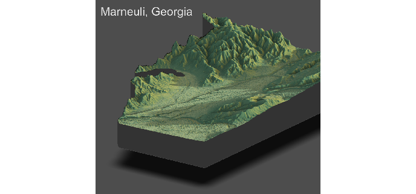
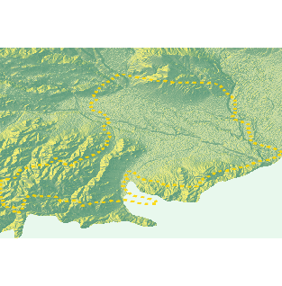
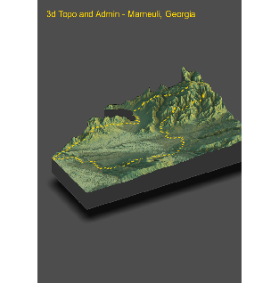
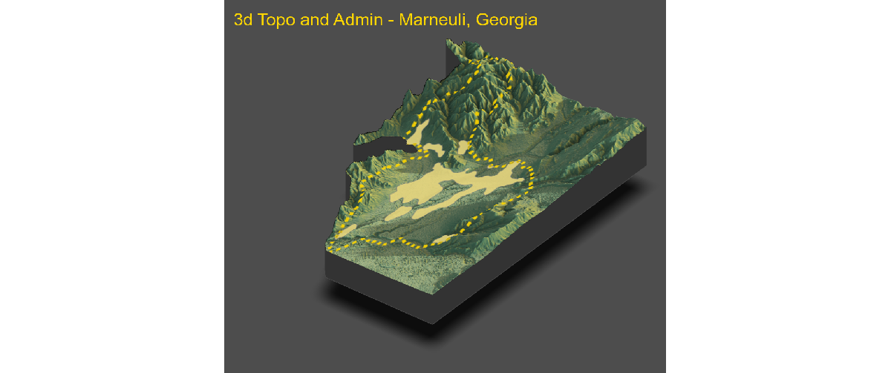
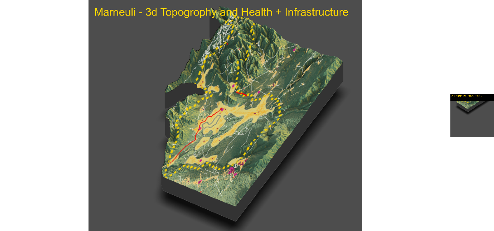

# Final Project by Kirill
  
#### This project was a development and combination of previous projects, during which we combined topography, administrative, and geospatial data to create graphs depicting a selected district of a country.
#### In this case graphs were developed depicting the district Marneuli of Georgia, its topographic data, and this was overlayed with administrative data and infrastructure data.
 
## Country - Georgia. District - Marneuli 

#### 2D Topography of Georgia

 
#### 2D Topography of Marneuli (district)

 
#### 3D Topography of Marneuli

 
##### Then overlayed the topography with administrative data representing the region's boundaries. Unfortunately there were some innacuracies during this process, but the main outline is evident.

#### 2D Topography and Administration of Marneuli

 
#### 3D Topography and Administration of Marneuli

 
##### Additionally overlayed topography and administrative data with data depicting the urban areas in the district (calculated in Project 5)
#### Topography, Admin and Urban Areas of Marneuli

 
##### Finally overlayed topography, administrative and urban data, with data representing roads (lines) and health sites (points) within the district.
#### Final Marneuli Plot

 
