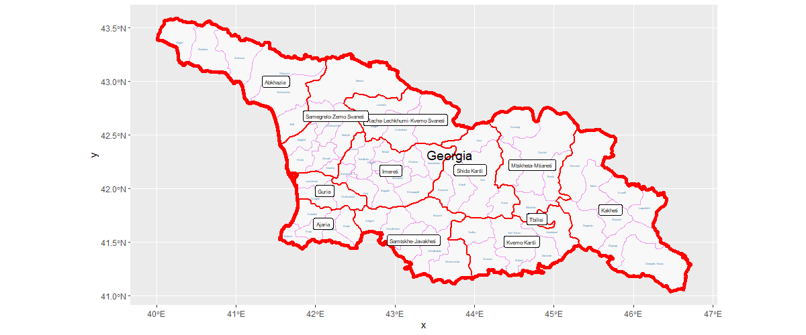

# This is the first project created by Kirill
  
#### Project involves using publicly available geospatial data (shape files) to create maps of a certain country.

## Country Selected - Georgia
### Flag:

### Challenge Question:

### Stretch Goal #1:

