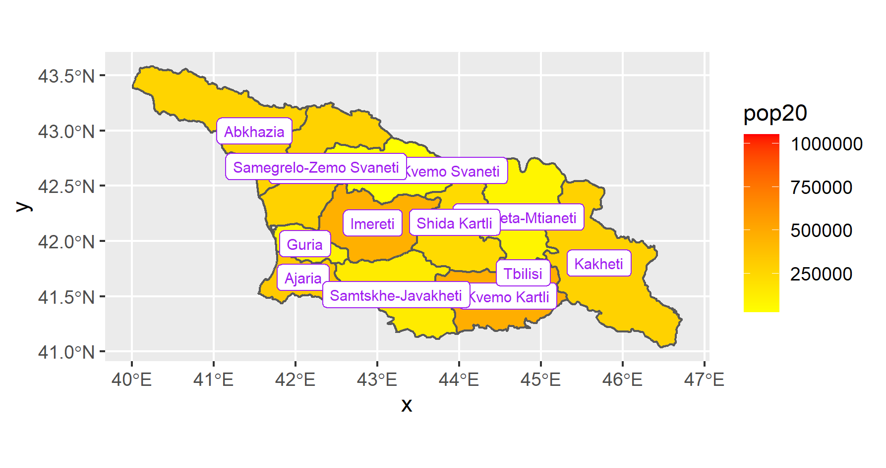

# Project #2 by Kirill
  
#### Project involves using satellite and geospatial data to create physical and population plots of a certain country

## Country Selected - Georgia

### 2.1 Deliverable:

### Stretch Goal #1:

### 2.2 Deliverable:

