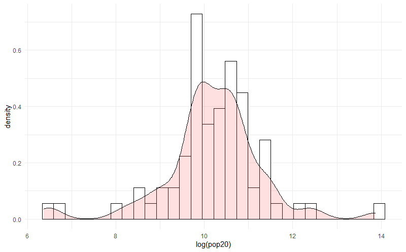
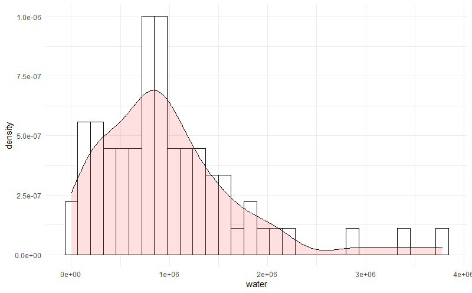
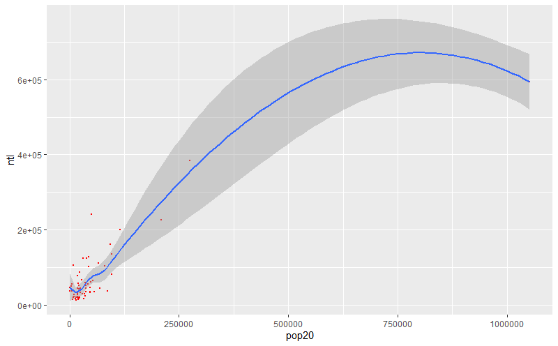

# Project #3 by Kirill
  
#### Project involves using satellite and geospatial data to map attributes of country and create plots and statistics analyzing the strength of correlation between variables.

## Country - Georgia

### 3.1 Deliverable:
##### Population Density vs Log of Population (divided by country regions)

 
##### Population Density vs Night Time Lights (divided by country regions)

 
##### Population Density vs Water (divided by country regions)

 
 

### 3.2 Deliverable:
##### Correlation Between Night Time Lights and Population. With a fitted regression and confidence interval.

##### Stats for model fit below. The R squared value of 0.74 suggests a moderately strong correlation.

 
##### Model of how Night Time Lights, Water, and Slope as Predictors predict the Population. With a fitted regression and confidence interval.

##### Stats for model fit below. The R squared value of 0.77 suggests a moderately strong correlation.

 
