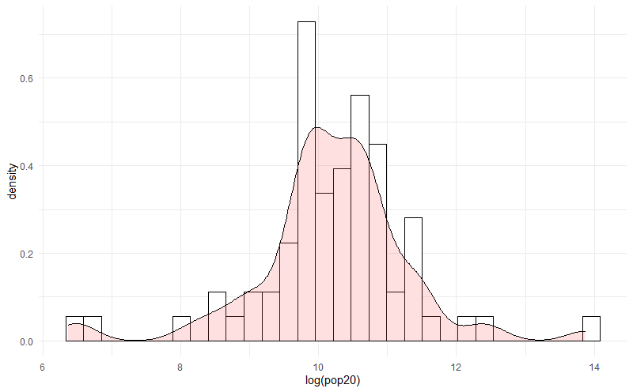
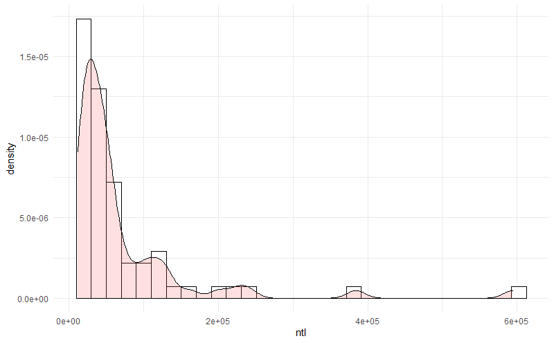

# Project #4 by Kirill
  
#### Project involved using satellite and geospatial data to analyze factors about a country, and developing and testing models explaining certain characteristics of a country. 
#### Specifically during this project we developed a model in R that explained the population distribution in a country through a variety of explaining factors such as topogrophy, land use, water spacing, night lights, etc.
#### We then tested the validity and accurateness of this model

## Country - Georgia

##### Population Density vs Log of Population (divided by country regions)

 
##### Population Density vs Night Time Lights (divided by country regions)

 
##### Population Density vs Water (divided by country regions)

 
