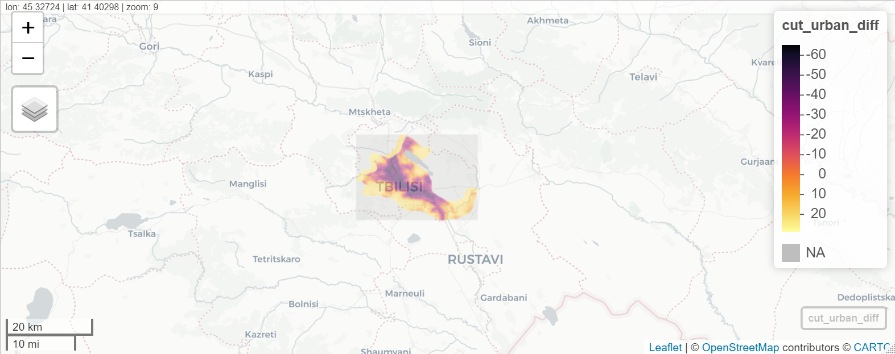

# Project #4 by Kirill
  
#### Project involved using satellite and geospatial data to analyze factors about a country, and developing and testing models explaining certain characteristics of a country. 
#### Specifically during this project we developed a model in R that explained the population distribution in a country through a variety of explaining factors such as topogrophy, land use, water spacing, night lights, etc.
#### We then tested the validity and accurateness of this model

## Country - Georgia

#### Plot Depicting the Difference between Predicted Values and the Actual Data
##### Data shows that the model significantly overestimates population values (in green) everywhere but in a few urban centers, where there is actually some underestimation (dark colors).

 
#### Plots Depicting the Difference between Predicted Values and Population Data in Largest Urban Center (Tbilisi)
##### Data shows that the model underestimates the population for a significant portion of the urban centers, likely because it generally averages population with the rest of the country and more evenly distributes the population. 

 

