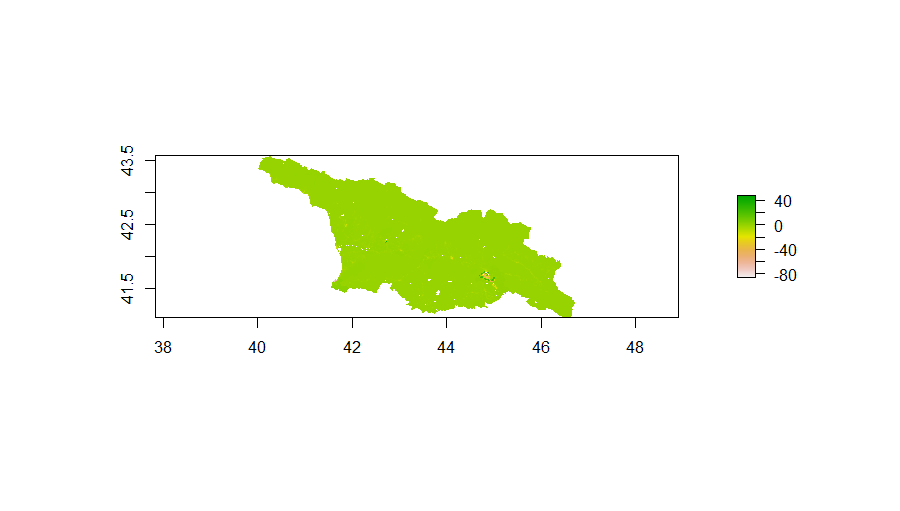
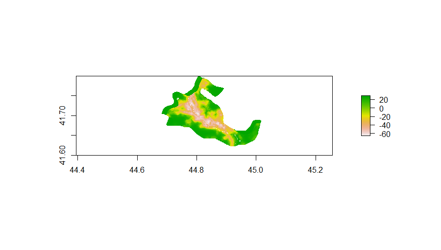
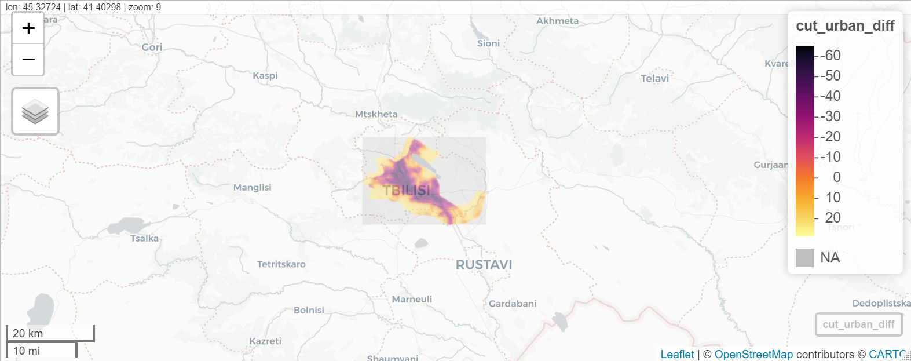

# Project #5 by Kirill
  
#### During this project we selected a district within a country and created graphs depicting its population density. We then analysed the population distribution of the area to determine what some defacto (natural) boundaries of counties/cities/towns would be.
#### We plotted the result and analyzed their accuracy. Additionally we then added additional geospatial data to depict the infrastructure (roads, health facilities) of the area and their location relative to the population density.
## Country - Georgia. District - Marneuli 

#### Plot Depicting the Difference between Predicted Values and the Actual Data
##### Data shows that the model significantly overestimates population values (in green) everywhere but in a few urban centers, where there is actually some underestimation (dark colors).

 
#### Plots Depicting the Difference between Predicted Values and Population Data in Largest Urban Center (Tbilisi)
##### Data shows that the model underestimates the population for a significant portion of the urban centers, likely because it generally averages population with the rest of the country and more evenly distributes the population. 

 

