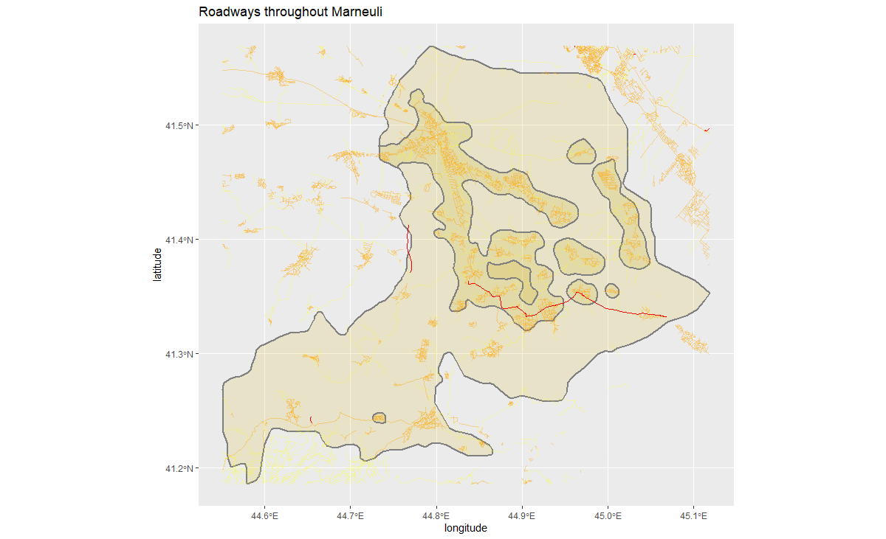

# Project #5 by Kirill
  
#### During this project we selected a district within a country and created graphs depicting its population density. We then analysed the population distribution of the area to determine what some defacto (natural) boundaries of counties/cities/towns would be.
#### We plotted the result and analyzed their accuracy. Additionally we then added additional geospatial data to depict the infrastructure (roads, health facilities) of the area and their location relative to the population density.
 
## Country - Georgia. District - Marneuli 

#### Plot Depicting the original Population Densities in Marneuli

 
#### Plot Depicting Marneuli Population as Points (Planar Point Pattern)

 
### Creation of a model which divided Marneuli into subpolygons (urban/rural areas) based on population density 
#### Marneuli Initial Subpolys

 
#### Marneuli Filtered Subpolys

 
### Creation of urban area graphs based on joining of subpolygons and pop density scale. 
#### Marneuli Base Urban Areas

 
#### Marneuli Full Graph of Urban Areas

 
 
### Importation of infrastructure data and addition of roads and healthcare facility data for Marneuli.
##### Red lines represent primary roads and motorways. Orange lines represent secondary roads and residential roads. Yellow (thin, pale) lines represent tertiary and track roads.
#### Marneuli Roads Graph

 
#### Marneuli Health Facilities

 
